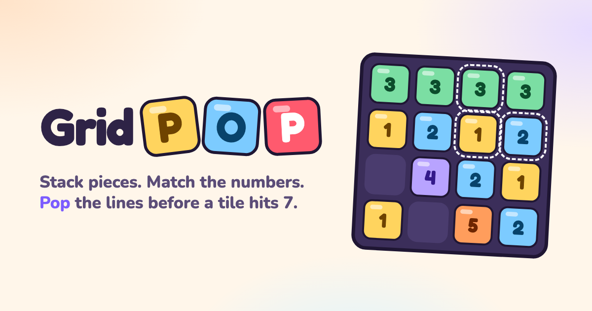
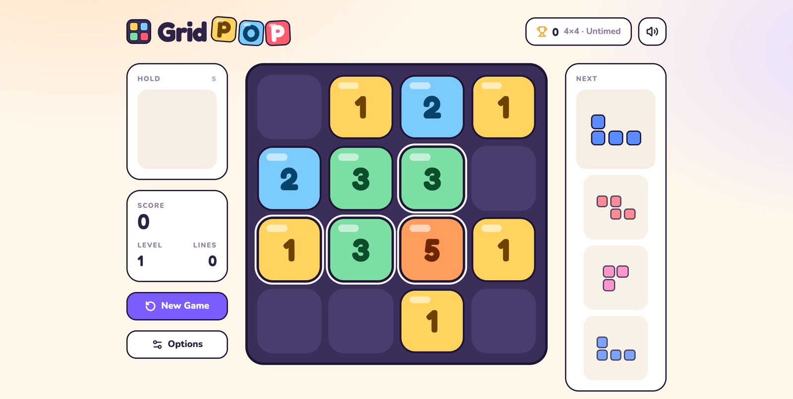

# GridPop



Stack pieces, match the numbers, and pop the lines before a tile hits 7.
**Play it at https://jamesurobertson.github.io/gridpop/**




## Getting Started

1. Clone the repository
2. Install dependencies with `npm install`
3. Run the development server with `npm run dev`

## Development

The project is built with:

- React
- TypeScript
- Tailwind CSS
- Vite

## Building for Production

To build the project for production:

```bash
npm run build
```

The built files will be in the `dist` directory.

## Deploying

Every push to `master` builds the game and publishes it to GitHub Pages at
https://jamesurobertson.github.io/gridpop/ (`.github/workflows/deploy.yml`). The site is served from
`/gridpop/`, which `vite.config.ts` sets as the base path.

## Credits

Sound effects: [Interface Sounds](https://kenney.nl/assets/interface-sounds) and
[Music Jingles](https://kenney.nl/assets/music-jingles) by Kenney (CC0). Fonts: Fredoka and Nunito (Google Fonts, OFL).
